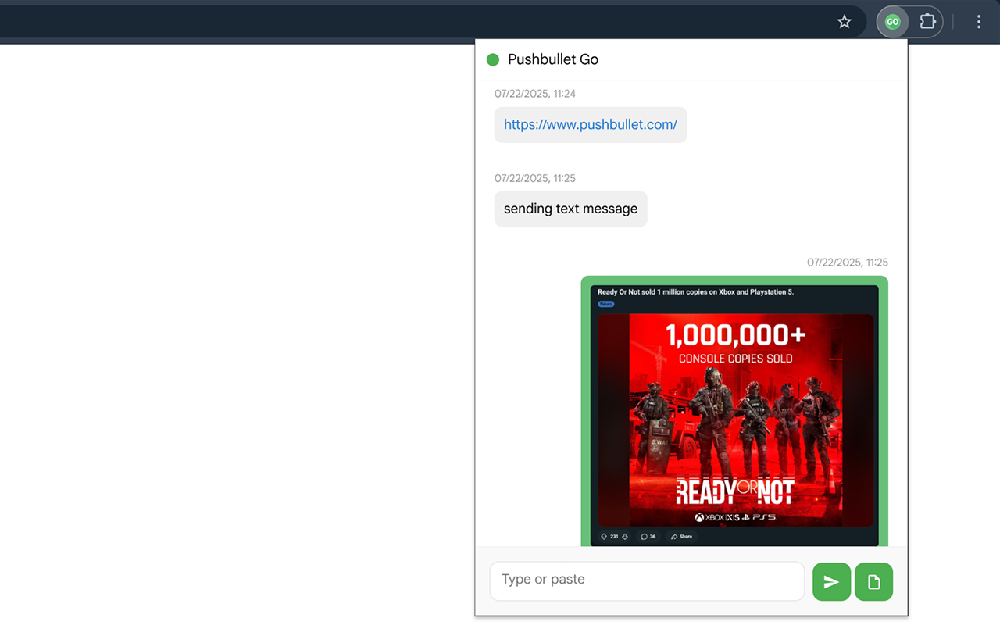

# Pushbullet Go
> **Note 1**: The extension name has been changed to "Push Go" due to Chrome Web Store policy.
> **Note 2**: This is a third-party, open-source client for Pushbullet API. Not affiliated with or endorsed by the service.

A lightweight Chrome extension for Pushbullet that enables receiving and sending pushes directly from your browser.

This extension is compatible with Manifest V3, making it an alternative to the official extension which no longer works.

## Features

Require a [Pushbullet](https://www.pushbullet.com/) account. Features include:

- Receive and send pushes
- Push files/images by pasting or uploading (in standalone window due to Chrome's restriction)
- Push current page's URL, selected text, or images from context menu with device/people selection
- Notifications for received pushes with button to open links
- Filter received pushes and control which devices to push to by selecting devices
- Stores 100 latest pushes locally (full history available on Pushbullet website)

## Installation
> **Note 3**: Requires Chrome 116+ for using `chrome.idle` API to maintain connection to Pushbullet's WebSocket server.

Install directly from the [Chrome Web Store](https://chromewebstore.google.com/detail/push-go/dghndapbehjdbhiffbckojkhoennbofg) or:

### Method 1: Install from Source
1. Download and unzip the source code from this repository
2. Open Chrome and navigate to `chrome://extensions/`
3. Enable "Developer mode" in the top right
4. Click "Load unpacked" and select the `/src` folder from the unzipped source code

### Method 2: Install from Release
1. Download the extension (crx file) from the `release/` folder
2. Open Chrome and navigate to `chrome://extensions/`
3. Enable "Developer mode" in the top right
4. Drag the crx file from Step 1 to the page to install
5. Click "Keep this extension" at the top of extension page (in three-dot menus)

## Setup

1. Get your access token from [Pushbullet settings](https://www.pushbullet.com/#settings/account)
2. Click the extension icon and enter your token
3. Start sending and receiving pushes!
4. (Optional) Select devices in options to filter incoming pushes and set push targets

## Permissions

This extension requires the following permissions:
- **Storage**: To save your options and push history locally
- **Idle**: To maintain the connection to receive pushes in real time
- **Notifications**: To display push notifications
- **Context Menus**: To add right-click menu options for pushing content
- **Active Tab**: To access current page's URL for context menu actions
- **Host Access**: To communicate with Pushbullet API servers

## Privacy

This extension stores everything locally and does not transmit any information beyond Pushbullet's API.

## License

This project uses the [AGPL-3.0 license](https://github.com/nemofq/pushbullet-go?tab=AGPL-3.0-1-ov-file). If you have any feature requests or feedback, feel free to create an issue or pull request.

## Support

This is a hobby project, you can buy me a coffee to support: https://buymeacoffee.com/nemofq

## One More Thing

If you're also an iOS+Pushbullet user, you may find these Shortcuts useful:

- [Push to Pushbullet](https://www.icloud.com/shortcuts/42b9dce7d6b44c72acd3e5c55b5de07a)
- [Pushbullet Receiver](https://www.icloud.com/shortcuts/1f94913de21b41debe60ef43631afde2)
