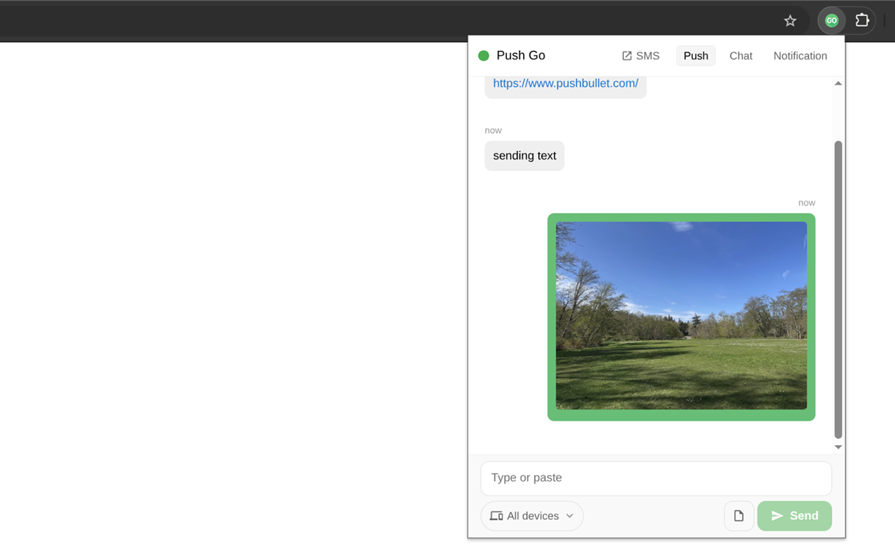

# Pushbullet Go

  

> **Note 1**: The official name of this extension is "Push Go for Pushbullet".
>
> **Note 2**: This is a third-party, open-source client for Pushbullet API. Not affiliated with or endorsed by Pushbullet.

A lightweight Chrome extension for Pushbullet that enables receiving and sending pushes directly from your browser.

This extension is compatible with Manifest V3, making it a drop-in alternative to the official extension, which no longer works in the latest Chrome and other Chromium-based browsers such as Brave.

## Features

Require a [Pushbullet](https://www.pushbullet.com/) account. Features include:

**Basics**

- Authenticate via OAuth or enter access token manually
- Unread counts and OS notifications with sound
- Supports i18n with 33 languages

**Push**

- Receive and send pushes
- Filter to show and notify pushes by target device
- Push files/images by pasting, dragging, or uploading
- Push current page's URL, selected text, or images from context menu
- Push via keyboard shortcut
- Set a default push target, or change it per-send in the popup
- Auto-open received links
- Quick share of current tab's link in the popup
- Clear local push history

**Chat**

- Per-person conversations with message history — send text and files the same way as pushes
- Mute/unmute conversations
- Auto-open links from selected people
- Clear local chat history per conversation

**Notification Mirroring**

- Receive mirrored notifications with end-to-end encryption support
- Extract verification codes from mirrored notifications and copy with one click in the popup

**SMS**

- The Pushbullet API doesn't provide full SMS endpoints, so SMS conversations like the official extension aren't possible for now. Instead, you can enable a popup shortcut that opens SMS on the Pushbullet website
- If you want SMS notifications mirrored to your browser, remember to turn off "SMS sync" in the Pushbullet Android app — otherwise they won't come through

**Customization**

Push Go offers fine-grained options for advanced users to tailor almost everything, such as:

- Auto-open tuning — include file pushes, auto-open on reconnect, hide auto-opened notifications
- Notification behavior — sound, hide pushes sent from browsers, require interaction to dismiss (per category), treat native close as dismiss
- Toggle individual features on/off — chat, notification mirroring, context menu, quick share, SMS shortcut
- Default popup tab and which unread counts to display
- Dark Mode (follows system by default, or choose manually)

## Installation
> **Note 3**: Requires Chrome 116+ for using `chrome.idle` API to maintain connection to Pushbullet's WebSocket server.

### Recommended

Install directly from the [Chrome Web Store](https://chromewebstore.google.com/detail/push-go/dghndapbehjdbhiffbckojkhoennbofg) or:

### Manual

1. Download and unzip the latest version from the [Releases page](https://github.com/nemofq/pushbullet-go/releases)
2. Open Chrome and navigate to `chrome://extensions/`
3. Enable "Developer mode" in the top right
4. Click "Load unpacked" and select the `/src` folder from unzipped

## Setup

1. Click the extension icon and select "Open Settings"
2. Enter access token via OAuth authentication or manually (from [Pushbullet settings](https://www.pushbullet.com/#settings/account))
3. Click retrieve button and start sending and receiving pushes!
4. Customize settings on the options page as needed

## Permissions

This extension requires the following permissions:
- **Storage**: To save your options and push/mirrored notification history locally
- **Idle**: To maintain the connection to receive pushes in real time
- **Notifications**: To display notifications in the browser
- **Context Menus**: To add right-click context menu options
- **Active Tab**: To access current page's URL and title for context menu and keyboard shortcut actions
- **Host Access**: To communicate with Pushbullet servers
- **Offscreen**: To play notification sound
- **Identity**: To complete OAuth process

## Privacy

This extension stores everything locally and does not transmit any information beyond Pushbullet's API. See the [full privacy policy](https://nemofq.github.io/pushbullet-go/privacy) for details.

## License

This project uses the [AGPL-3.0 license](https://github.com/nemofq/pushbullet-go?tab=AGPL-3.0-1-ov-file). 

## Feedback

If you have any feature requests or feedback, feel free to create an issue or pull request.

## One More Thing

If you're also an iOS+Pushbullet user, you may find these Shortcuts useful:

- [Push to Pushbullet](https://www.icloud.com/shortcuts/5549bbb5b06e4f0a8ccb1b6fd33e853f)
- [Pushbullet Receiver](https://www.icloud.com/shortcuts/1f94913de21b41debe60ef43631afde2)
